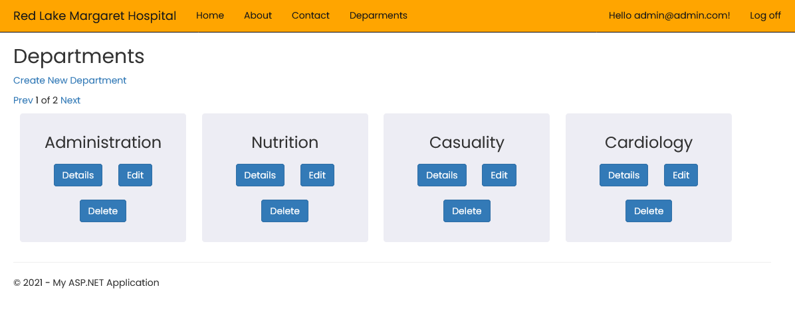
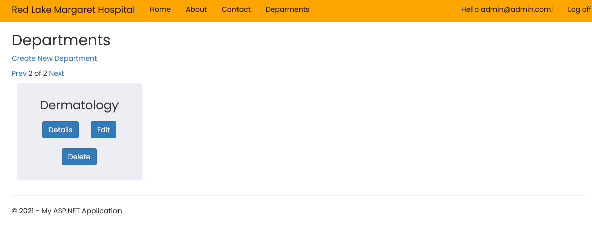
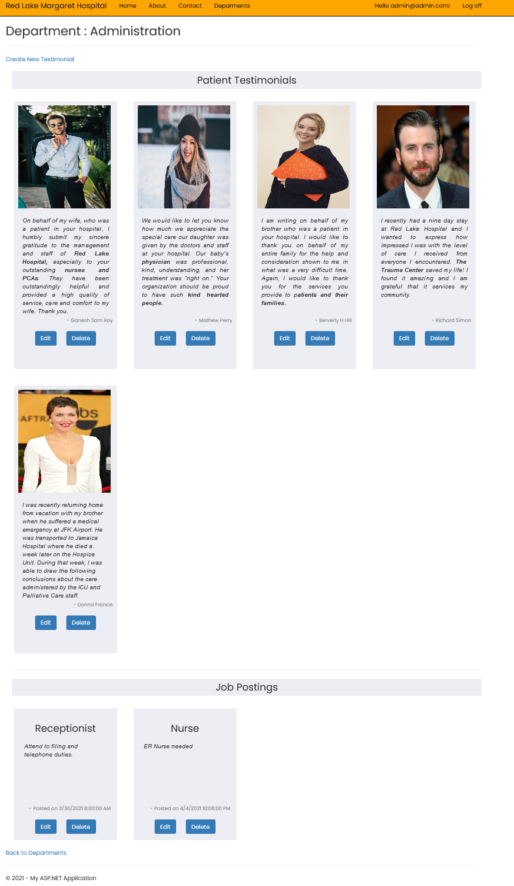
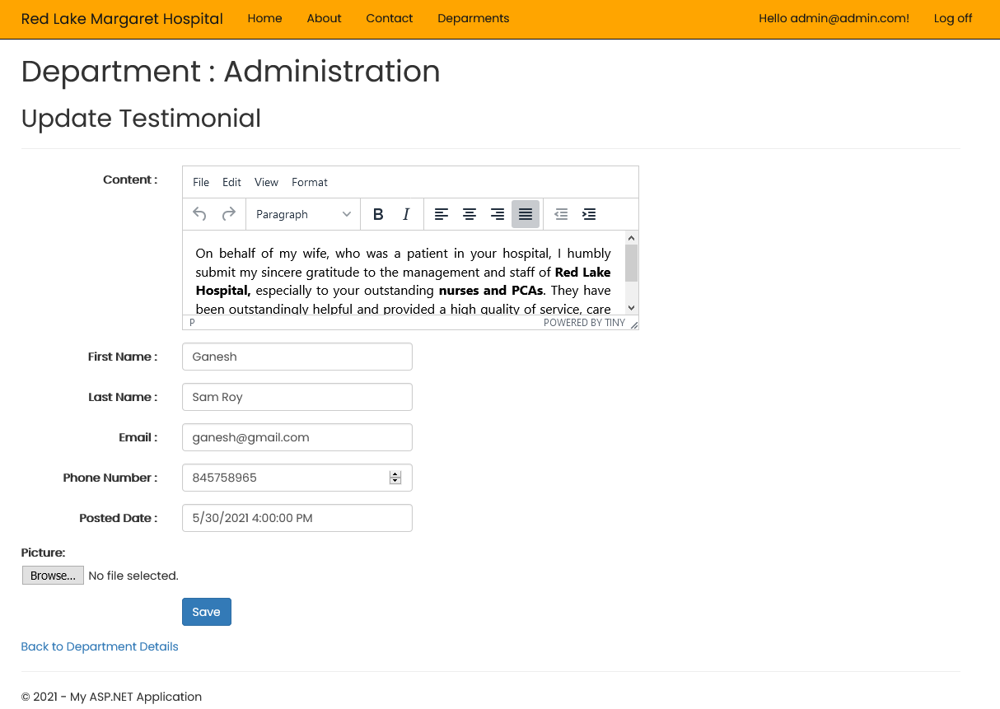
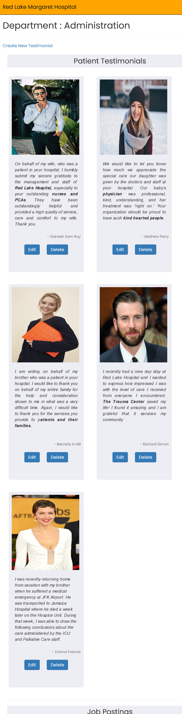

# Red Lake Hospital Project - Team 6

- Admin Account: Usr: admin@admin.com Pass: Test123*
- Regular User Account: Usr: user@user.com Pass: Test123*

## Nai-Hsien's Contributions - Online donation feature
### Models/ViewModels 
Models/Donation.cs  
Models/Donor.cs  
ViewModels/ShowDonation.cs
ViewModels/UpdateDonation.cs
### Controllers
Controllers/DonationDataController.cs  
Controllers/DonationController.cs  
Controllers/DonorDataController.cs  
### Views
all the views under donation and donor folders. All CRUD features are functioning now except for the following:
Views/Donation/Edit.cshtml (not currently fully functioning)  

### Debugging:
1. Solving merging conflict  
    - https://docs.github.com/en/github/collaborating-with-issues-and-pull-requests/resolving-a-merge-conflict-using-the-command-line#removed-file-merge-conflicts
    - see also project folder: documentation.pdf
2. Understanding how to work with git.ignore  
    - https://docs.microsoft.com/en-us/azure/devops/repos/git/ignore-files?view=azure-devops&tabs=visual-studio#ignore-files-only-on-your-system

## Gord's Contributions - Job Posting and Job Application Features

### Changes for Final Submission
- Implemented public-private key security for API controller resources
- Created new API controller to distribute server's public key to clients
- Split up JobsApiController by subject entities into JobsApplicationsApiController and JobPostingsApiController
- Moved job posting list view's processing work to the API controller using option flags allowing the return of all job postings or only unexpired/current job postings

#### Files Changed or Added for Final Submission
- /Controllers/JobsViewController.cs
- /Controllers/JobsApplicationsApiController.cs
- /Controller/JobsPostingsApiController.cs
- /Controller/PublicKeyDistributionController.cs
- /Models/Authentication.cs
- /Models/PublicKeyDto.cs

### Controllers
Set up role and users  
JobsApiController.cs  
JobsViewController.cs  

### Models and ViewModels
DepartmentsModel.cs  
JobApplicationsModel.cs  
JobPostingsModel.cs  
JobApplicationViewModel.cs  
JobPostingsViewModel.cs  

### Views
All views inside /Views/JobView directory

## Kunal's Contributions - Contact Us and Send E-cards Features

### Changes for final Submission 
- Proper Commenting Added.
- Added responsiveness to the features.
- Customized HTML/CSS
- Styling & Adding dynamic content to the home page (Shared/_Layout.cshtml)
- Added adminstrator log in functionality to operate CRUD on admin side.

### Controllers
ContactsController.cs  
ContactsDataController.cs  
EcardsController.cs  
EcardsDataController.cs  

### Models and ViewModels
Contacts.cs  
Ecards.cs  
ShowContact.cs  
UpdateContact.cs  
ListContact.cs  
ShowEcard.cs  
EditEcard.cs  

### Views
## Views for Contact Us
All views inside /Views/Contact directory
## Views for E-cards
All views inside /Views/Ecards directory

## Jerrin's Contributions - Department and Testimonial Features

#### Files Changed or Added for Final Submission
- Added admin CRUD functionality to all the departments and Testimonials in the database.
- Added responsiveness to all the HTML elements with the help of Bootstrap
- Added Validations for all the input HTML elements
- Added a WYSIWYG editor for the Update Testimonial Page
- Added Pagination for the Department Listing page
- Added Image uploading for the testimonials in the database.
- Added Customised HTML/CSS UI's for departments and testimonials
- Joined Job postings for the existing departments along with the testimonials for the department ( As suggested by Christine when MVP was submitted)
- Pictures of the UI screens shown below
  

### Controllers

TestimonialDataController.cs  
TestimonialController  
DepartmentDataController.cs  
DepartmentController.cs  

### Models and ViewModels

ViewModels - DepartmentDetails.cs, TestimonialDetails.cs
Models - Testimonial.cs, DepartmentsModel.cs

### Views
## Views for Department
All views inside /Views/Department directory
## Views for Testimonial
All views inside /Views/Testimonial directory

## Braydons's Contributions - FAQ and Photos

### Controllers
FaqDataController.cs  
FaqController.cs  
PhotoDataController.cs  
PhotoController.cs  
DepartmentsDataController.cs

### Models and ViewModels
Faq.cs  
Phot.cs  
ListFaq.cs  
ListPhoto.cs  
ShowFaq.cs  
ShowPhoto.cs  
UpdatePhoto.cs  
UpdateFaq.cs  

### Views
## Views for Faq
All views inside /Views/Faq directory
## Views for Photos
All views inside /Views/Photo directory
